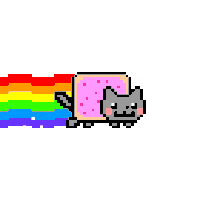

  <small>./about.conf</small>
  <h1 style="margin-top: 20px; font-family: monospace; color: #E0E0E0;">
    Youseph Zidan
     
    <h2 style="font-size: 18px; color: #B0B0B0; padding-top: 10px">Software Engineer</h2>
  </h1>
  

    I'm Youseph Zidan, a software engineer with over three years of hands-on experience crafting real world applications from frontend interfaces to backend logic and automation scripts. I focus on writing robust, scalable, and user centric solutions, always bridging creative ideas with functional execution. Passionate about learning and collaboration, I enjoy solving complex problems and contributing to impactful projects.
  

<!--

  

    <h2>  | ./tech_stack.conf <tr> </h2>
     
  

  <h3>Languages</h3>
  

    
Python

    
Javascript

    
SQL

    
MU | HTML, CSS

  

  <h3>Frameworks/libs</h3>
  

    
Flask

    
SocketIO

    
React

    
TailwindCSS

    
Sass

    
Asyncio

  

  <h3>Databases</h3>
  

    
PostgresSQL

    
MongoDB

  

  <h3>DevOps</h3>
  

    
AWS

    
Cloud

    
Git

    
Linux

    
CI/CD

  

-->

  <h2>Contact</h2>
  

    Email: <a href="mailto:yousephzidan10@proton.me"> yousephzidan10@proton.me </a> 
    Linkedin: <a href="https://www.linkedin.com/in/yousephzidan/" target="_blank" rel="noopener noreferrer"> linkedin.com/in/yousephzidan </a>
  

   

